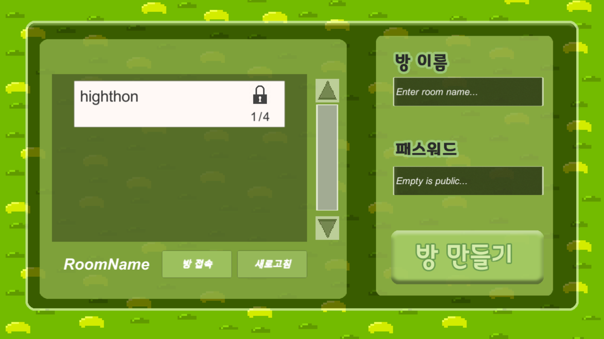

# 복쓸복쓸

## 게임소개

멀티 게임을 통해 상대방보다 복을 많이 쓸어 담아 복주머니를 채우면 이기는 게임

## 개발일정

- 2020/01/18 ~ 2020/01/19

## 만든 사람들

- Unity Developer 송은우
- Backend Developer 염태민
- Designer 최우혁
- Designer 정유진

## 사용 기술

- Node.js(12.14.0)
- Socket.io(0.9.6)

## 느낀점

유니티와 Node.js간의 Socket.io 통신을 하기 위하여 많은 노력을 하였다. Unity같은 경우에는 Socket.io 구버전 프로토콜만 지원을 하기 때문에 버전을 0.9.6으로 낮추었는데 옛날 문법이라 오류가 나서 socket.io 안에 오류나는 부분만 최신 문법으로 변경하는데 꽤 힘들었다.

## 스크린샷

